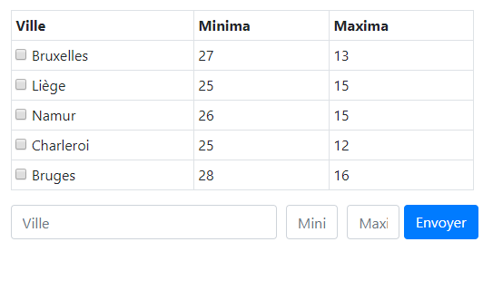

# Base de donnée météo PHP MySQL

* Exercice solo
* Formation: BeCode
* Réalisé en deux jours
* PHP, MySQL, Javascript

Cet exercice vise à mettre en application les requêtes MySQL avec un PHP via le PDO.

Il a fallu lister les éléments contenu dans la base de donnée, pouvoir ajouter de nouveaux éléments via le formulaire et pouvoir supprimer des éléments avec les cases à cocher.

## Procédé

Une fois le formulaire envoyée, un autre fichier PHP va traiter les information pour vérifier, désinfecter et si les données sont correctes les envoyer à la base de donnée.

Cocher un élément va enclencher une fonction JavaScript qui va récolter l'ID correspondant à l'entrée cochée et va faire une requête SQL pour supprimer l'élément en question.

## Comment tester?

Importer la base de donnée inclut dans ce dépot via phpMyAdmin, modifier les informations de connections dans chaque PDO si nécessaire et ouvrir le dossier de l'exercice dans un serveur apache (WAMP, XAMPP, Laragon ou autre)